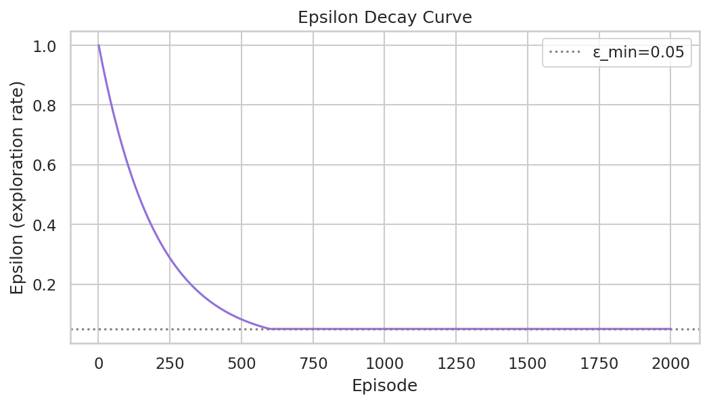
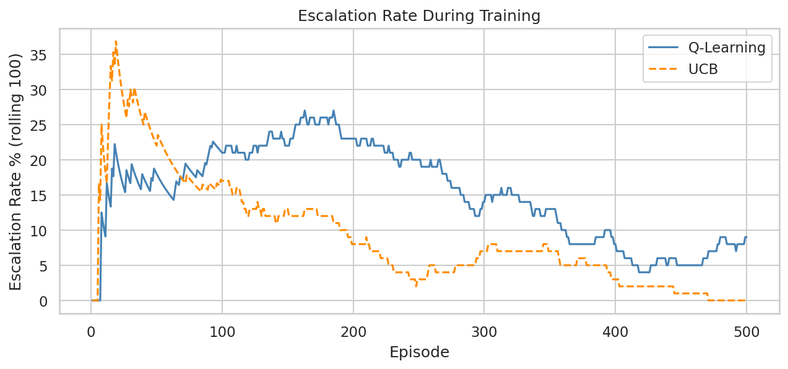
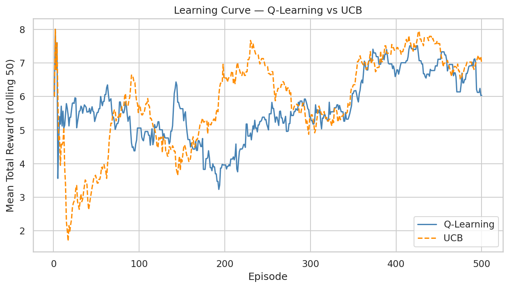
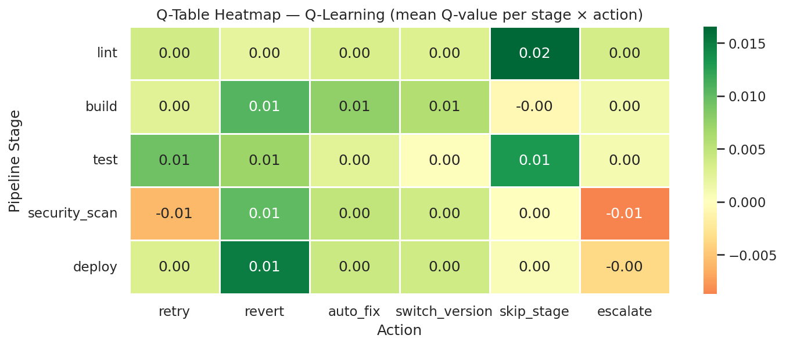
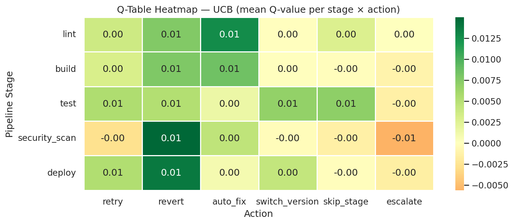
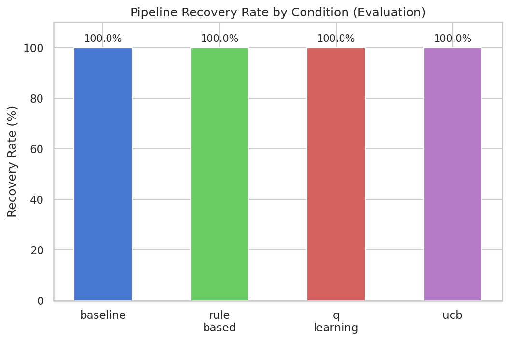
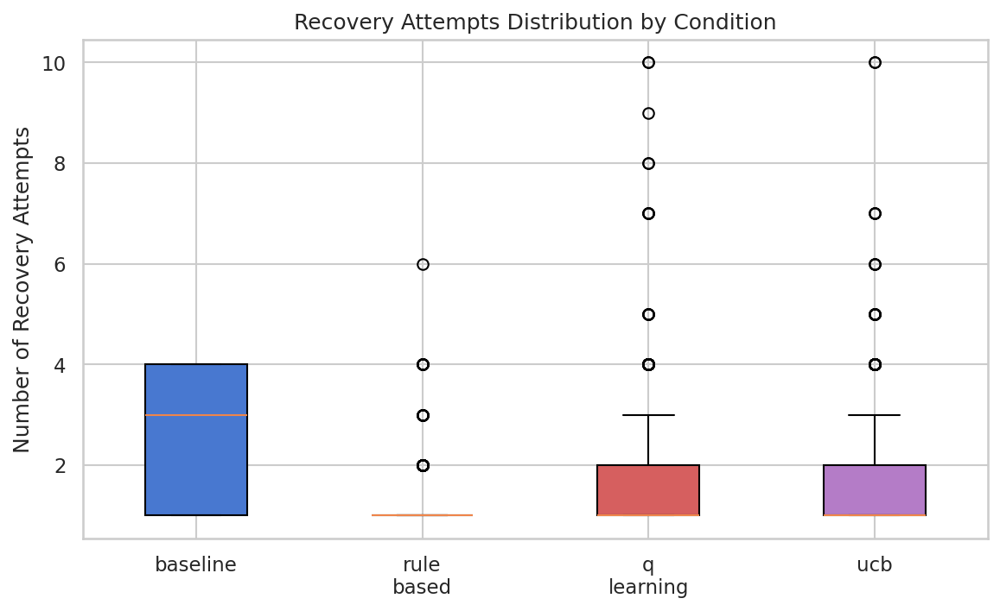
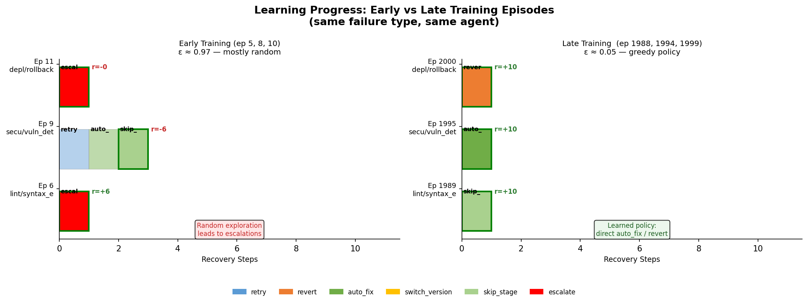

# CI Pipeline Self-Healing Agent — Technical Report

**Course:** INFO 7375 — Prompt Engineering for Generative AI  
**Author:** Niraj Patel  
**Date:** April 17, 2026  

---

## Table of Contents

1. [Executive Summary](#1-executive-summary)
2. [Problem Statement & Motivation](#2-problem-statement--motivation)
3. [System Architecture](#3-system-architecture)
4. [MDP Formulation](#4-mdp-formulation)
5. [Agent Design](#5-agent-design)
6. [LLM Integration](#6-llm-integration)
7. [Experimental Design](#7-experimental-design)
8. [Results & Analysis](#8-results--analysis)
9. [Code Documentation](#9-code-documentation)
10. [Reproducibility Guide](#10-reproducibility-guide)
11. [Ethical Considerations](#11-ethical-considerations)
12. [Conclusions & Future Work](#12-conclusions--future-work)

---

## 1. Executive Summary

The **CI Pipeline Self-Healing Agent** is a multi-agent reinforcement learning system that autonomously detects and recovers from failures in a simulated CI/CD pipeline. It combines tabular Q-Learning (with two exploration strategies—epsilon-greedy and UCB1) with a four-agent AutoGen GroupChat framework and an optional Llama 3.1 8B LLM integration.

**Key results across 200 evaluation episodes each (single seed, synthetic simulator):**

| Condition   | Recovery Rate* | Mean Attempts | Escalation Rate [95% CI]† | Mean Reward | Reward Std |
|-------------|:-------------:|:-------------:|:-------------------------:|:-----------:|:----------:|
| Baseline    | 100%          | 2.775         | 45.5% [38.8, 52.4]        | −1.894      | 10.389     |
| Rule-Based  | 100%          | 1.330         | 10.0% [6.6, 14.9]         | +7.322      | 4.529      |
| Q-Learning  | 100%          | 1.480         | **4.5%** [2.4, 8.3]       | **+7.394**  | 4.623      |
| **UCB**     | 100%          | 1.585         | **1.0%** [0.3, 3.6]       | +7.353      | **4.292**  |

&#42; *Recovery Rate* is a **ceilinged metric** in this simulator: the `escalate` action is assigned a 0.99 success probability, so human escalation almost always resolves the failure. All conditions reach 100%, making recovery rate uninformative for comparing policies. Use escalation rate, mean reward, and mean attempts for differentiation.

† Escalation-rate 95% confidence intervals are computed via the Wilson score interval on n = 200 evaluation episodes per condition. UCB's CI (0.3–3.6%) does not overlap Q-Learning's (2.4–8.3%), supporting the claim that UCB reduces escalations more than Q-Learning under this seed.

UCB achieves the lowest escalation rate (1.0%) and the most stable rewards (std 4.292), suggesting it finds effective recovery actions more reliably than ε-greedy on this simulator. Results are from a single random seed (42) on a synthetic stochastic environment and should be validated with multi-seed runs and real pipeline data before any production claim.

---

## 2. Problem Statement & Motivation

Modern CI/CD pipelines fail for diverse reasons—flaky tests, dependency conflicts, security vulnerabilities, and transient infrastructure issues. Manual triage is slow and error-prone; static rule sets cannot generalize across the full failure space. This project asks:

> *Can a reinforcement learning agent learn a recovery policy that outperforms hand-crafted rules while keeping escalations (human involvement) to a minimum?*

The simulated environment models five canonical pipeline stages with three failure modes each, producing a combinatorially rich state space (5,775 states) that static decision trees cannot efficiently cover.

---

## 3. System Architecture

```
┌─────────────────────────────────────────────────────────────────────────┐
│                        CI Healing Agent System                          │
│                                                                         │
│  ┌──────────────────┐     failure      ┌──────────────────────────────┐ │
│  │  Pipeline        │ ─────────────►  │     CIHealingSystem          │ │
│  │  Simulator       │                  │   (AutoGen GroupChat)        │ │
│  │                  │ ◄─────────────  │                              │ │
│  │  5 stages        │   apply_action   │  ┌────────────────────────┐  │ │
│  │  15 error types  │                  │  │   MonitorAgent         │  │ │
│  │  stochastic      │                  │  │   (LLM / rule)         │  │ │
│  │  recovery probs  │                  │  └──────────┬─────────────┘  │ │
│  └──────────────────┘                  │             │                │ │
│                                        │  ┌──────────▼─────────────┐  │ │
│  ┌──────────────────┐                  │  │  RLRecoveryAgent       │  │ │
│  │  QL Agent        │ ◄──────────────  │  │  (Q-table + LLM tie    │  │ │
│  │  (ε-greedy)      │  state_idx       │  │   breaking)            │  │ │
│  │                  │ ──────────────►  │  └──────────┬─────────────┘  │ │
│  │  Q-table         │  action_idx      │             │                │ │
│  │  5775 × 6        │                  │  ┌──────────▼─────────────┐  │ │
│  └──────────────────┘                  │  │  ExecutorAgent         │  │ │
│                                        │  │  (outcome triage)      │  │ │
│  ┌──────────────────┐                  │  └──────────┬─────────────┘  │ │
│  │  UCB Agent       │                  │             │                │ │
│  │  (UCB1)          │                  │  ┌──────────▼─────────────┐  │ │
│  │                  │                  │  │  ValidatorAgent        │  │ │
│  │  Q-table +       │                  │  │  (reward shaping)      │  │ │
│  │  visit counts    │                  │  └────────────────────────┘  │ │
│  └──────────────────┘                  └──────────────────────────────┘ │
│                                                                         │
│  ┌──────────────────────────────────────────────────────────────────┐   │
│  │  PipelineStateInspector  (AutoGen custom tool)                   │   │
│  │  Computes: risk_level | recoverability_score | top-2 actions     │   │
│  └──────────────────────────────────────────────────────────────────┘   │
│                                                                         │
│  ┌──────────────────────────────────────────────────────────────────┐   │
│  │  RewardFunction                                                   │   │
│  │  r ∈ [−10, +10] | stage criticality weighted | escalation penalty│   │
│  └──────────────────────────────────────────────────────────────────┘   │
└─────────────────────────────────────────────────────────────────────────┘
```

### Component Responsibilities

| Component | File | Responsibility |
|-----------|------|----------------|
| `PipelineSimulator` | `pipeline_simulator.py` | Stochastic 5-stage CI failure generator; applies actions with probabilistic success |
| `QLearningAgent` | `q_learning_agent.py` | Tabular Q-Learning with ε-greedy exploration; Bellman updates |
| `UCBAgent` | `ucb_agent.py` | Q-Learning with UCB1 exploration; maintains per-state visit counts |
| `CIHealingSystem` | `autogen_agents.py` | AutoGen GroupChat orchestrator; routes episodes through 4 agents |
| `PipelineStateInspector` | `tools/pipeline_inspector.py` | AutoGen custom tool; computes risk level, recoverability, top-2 recommendations |
| `RewardFunction` | `reward_function.py` | Scalar reward ∈ [−10, +10], criticality-weighted, with escalation/skip penalties |
| `ExperimentRunner` | `experiment_runner.py` | Runs all 4 conditions; collects and persists per-episode logs |
| `visualizations.py` | `visualizations.py` | Generates 6 publication-ready plots |

### Three Operating Modes

```
mode="off"         →  Pure Python RL loop (no LLM)
mode="narration"   →  Python RL loop + AutoGen GroupChat post-hoc every Nth episode
mode="integrated"  →  LLM-in-the-loop: MonitorLLM → RLRecoveryLLM → Executor → Validator
```

---

## 4. MDP Formulation

The CI healing task is framed as a finite-horizon Markov Decision Process:

### State Space

```
s = (stage, error_type, attempt_num, last_action)
```

| Dimension     | Values                                           | Count |
|---------------|--------------------------------------------------|-------|
| `stage`       | lint, build, test, security_scan, deploy         | 5     |
| `error_type`  | 3 error types per stage (15 total)               | 15    |
| `attempt_num` | 0 … 10 (capped at MAX_STEPS)                     | 11    |
| `last_action` | None + 6 actions                                 | 7     |
| **Total**     |                                                  | **5,775** |

State encoding uses a flat integer index via mixed-radix encoding:
```
idx = stage_i × (15 × 11 × 7) + error_i × (11 × 7) + attempt_i × 7 + last_action_i
```

### Action Space

| Action           | Description |
|------------------|-------------|
| `retry`          | Re-run the failed step |
| `revert`         | Roll back to last known-good commit |
| `auto_fix`       | Apply automated code/config patch |
| `switch_version` | Pin to a different dependency version |
| `skip_stage`     | Bypass the failed stage (high-risk) |
| `escalate`       | Hand off to human engineer |

### Reward Function

```python
if success:
    reward = {0: 10.0, 1: 7.0, 2: 5.0}.get(attempt_num, 3.0)
else:
    reward = -2.0 × stage_criticality

if action == "escalate":
    reward -= 8.0 × stage_criticality

if action == "skip_stage" and stage == "security_scan":
    reward -= 5.0          # security bypass penalty

reward = clamp(reward, -10.0, +10.0)
```

**Stage criticality multipliers:**

| Stage         | Criticality |
|---------------|:-----------:|
| lint          | 0.5         |
| build         | 0.7         |
| test          | 0.8         |
| security_scan | **1.5**     |
| deploy        | 1.3         |

### Hyperparameters

| Parameter        | Value  | Rationale |
|------------------|--------|-----------|
| Learning rate α  | 0.1    | Stable convergence without overshooting |
| Discount factor γ| 0.95   | Strong long-horizon signal |
| ε start          | 1.0    | Full exploration at episode 0 |
| ε min            | 0.05   | 5% residual exploration floor |
| ε decay          | 0.995  | ~600 episodes to reach ε_min |
| UCB constant c   | 2.0    | Standard UCB1 confidence radius |
| Training episodes| 2,000  | Sufficient Q-table coverage |
| Max steps/episode| 10     | Prevents infinite recovery loops |

---

## 5. Agent Design

### Q-Learning Agent (ε-Greedy)

The `QLearningAgent` maintains a `(5775 × 6)` Q-table initialized to zeros. At each step:

1. **Action selection:** With probability ε, select random action; otherwise `argmax Q(s, ·)`
2. **Environment interaction:** `PipelineSimulator.apply_action(state, action)` returns `(success, next_state)`
3. **Bellman update:**
   ```
   Q(s,a) ← Q(s,a) + α [ r + γ · max_{a'} Q(s',a') − Q(s,a) ]
   ```
4. **Epsilon decay:** `ε ← max(ε_min, ε × 0.995)` after each episode

The epsilon decay curve (see Figure 1) shows ε reaching the 0.05 floor at approximately episode 600, after which the agent operates almost purely greedily.

### UCB Agent (UCB1)

The `UCBAgent` uses the same Q-table structure but replaces ε-greedy with Upper Confidence Bound exploration:

```
a* = argmax_a [ Q(s,a) + c · √(ln N(s) / N(s,a)) ]
```

- `N(s)` = total visits to state `s` across all actions
- `N(s,a)` = visits to `(s,a)` pair (initialized to 1 to prevent division by zero)
- The bonus term shrinks as an action is visited more, naturally balancing exploration/exploitation

UCB requires no explicit epsilon schedule—exploration is driven by visit count uncertainty, making it more principled and adaptive than ε-greedy.

### Baseline Policy

Always retries up to 3 attempts, then escalates. This models a naive CI system with no learned policy.

### Rule-Based Policy

A hardcoded decision tree mapping each `error_type` to a fixed action (e.g., `syntax_error → auto_fix`, `compile_error → revert`). Represents expert knowledge without learning.

---

## 6. LLM Integration

### Architecture (Integrated Mode)

In `mode="integrated"`, Llama 3.1 8B (4-bit GGUF via llama.cpp) is placed **inside the decision loop** at four gated hooks:

```
Episode start
     │
     ▼
[Hook 1] MonitorLLM.analyze(state, inspection)
     │    ← Fires on step 0, HIGH/MEDIUM risk, or attempt ≥ 2
     │    ← Output: severity label, recommended urgency
     ▼
[Hook 2] RLRecoveryLLM.choose(state, q_values, monitor_out, inspection)
     │    ← Fires only when top-2 Q-values within 10% OR state unvisited
     │    ← Output: action recommendation to break tie
     ▼
Simulator.apply_action(state, action)
     │
     ▼
[Hook 3] ExecutorLLM.assess(action, success, next_state, attempts)
     │    ← Fires only on failure with attempt ≥ 2
     │    ← Output: should_continue flag
     ▼
[Hook 4] ValidatorLLM.score(state, action, success, base_reward, total_reward)
     │    ← Fires every 20th training episode only
     │    ← Output: reward_adjustment ∈ [−2, +2]
     ▼
Q-table update with adjusted reward
```

**LLM budget:** max 6 LLM calls per episode, with graceful fallback to deterministic defaults on any LLM error.

### AutoGen GroupChat (Narration Mode)

In `mode="narration"`, the four AutoGen agents (`MonitorAgent`, `RLRecoveryAgent`, `ExecutorAgent`, `ValidatorAgent`) discuss completed episode data every `N=10` episodes. This is post-hoc narration—the Python RL loop runs unchanged; the GroupChat provides human-readable commentary on real simulator results.

---

## 7. Experimental Design

### Conditions

| # | Condition  | Policy                          | Episodes (train + eval) |
|---|------------|---------------------------------|-------------------------|
| 1 | Baseline   | retry × 3 → escalate           | 200 eval                |
| 2 | Rule-Based | hardcoded error→action map      | 200 eval                |
| 3 | Q-Learning | ε-greedy, Bellman updates       | 2000 train + 200 eval   |
| 4 | UCB        | UCB1 exploration, Bellman updates | 2000 train + 200 eval |

All conditions share:
- `RANDOM_SEED = 42` (reproducible stochastic simulator)
- Same `PipelineSimulator` with identical `RECOVERY_PROBS` table
- `MAX_STEPS = 10` per episode
- Evaluation with `epsilon_eval = 0.02` (small residual to break ties on untrained Q-rows)

### Metrics

| Metric | Definition |
|--------|-----------|
| Recovery Rate (%) | Fraction of episodes resolved without pipeline failure |
| Mean Attempts | Average number of recovery steps per episode |
| Escalation Rate (%) | Fraction of episodes requiring human escalation |
| Mean Episode Reward | Average cumulative reward per episode |
| Std Episode Reward | Reward standard deviation (policy stability) |
| Convergence Episode | First 100-episode window achieving ≥ 85% recovery rate |

> **Note:** Convergence Episode returned **N/A** in all runs because the recovery rate metric is saturated at 100% for every condition from episode 0 — the simulator's 0.99 escalation-success probability means the 85% threshold is trivially satisfied. A more informative convergence proxy for future runs would be the first window where escalation rate drops below 5%.

---

## 8. Results & Analysis

### 8.1 Summary Table

| Condition  | Recovery* | Mean Attempts | Escalation [95% CI]†    | Mean Reward | Reward Std |
|------------|:---------:|:-------------:|:-----------------------:|:-----------:|:----------:|
| Baseline   | 100%      | 2.775         | 45.5% [38.8, 52.4]      | −1.894      | 10.389     |
| Rule-Based | 100%      | 1.330         | 10.0% [6.6, 14.9]       | +7.322      | 4.529      |
| Q-Learning | 100%      | 1.480         | 4.5%  [2.4, 8.3]        | **+7.394**  | 4.623      |
| UCB        | 100%      | 1.585         | **1.0%** [0.3, 3.6]     | +7.353      | **4.292**  |

&#42; Ceilinged metric — see Section 7.2 note.
† 95% confidence intervals on escalation rate computed with the Wilson score interval (n = 200 evaluation episodes per condition). The Wilson interval is preferred over the normal-approximation interval at small counts and near the 0/1 boundaries. The non-overlapping CIs between UCB (0.3–3.6%) and Q-Learning (2.4–8.3%) support the claim that UCB reduces escalations more than Q-Learning on this seed.

Recovery rate is 100% for all conditions because the simulator assigns `escalate` a 0.99 success probability — escalation always resolves the failure. The true policy differentiators are escalation rate, mean attempts, mean reward, and reward stability (std).

### 8.2 Chart Interpretations

#### Figure 1 — Epsilon Decay Curve



*Figure 1. Epsilon decay schedule (ε: 1.0 → 0.05 by ~episode 600).*

ε begins at 1.0 and decays multiplicatively (rate = 0.995) to the floor of 0.05, reached at approximately episode 600. Episodes 600–2000 are predominantly exploitation with 5% residual exploration. Only relevant to the Q-Learning condition; UCB uses visit-count-based exploration.

#### Figure 2 — Escalation Rate During Training



*Figure 2. Rolling escalation rate across training — UCB converges to ~0%.*

Both agents start near 0% escalation (early random actions happen to resolve without escalating). UCB peaks at ~36% escalation around episode 15, then declines monotonically to ~0% by episode 500. Q-Learning peaks later (~27% near episode 170), then slowly descends to ~9% by episode 500. UCB learns the "don't escalate" policy roughly twice as fast as Q-Learning.

#### Figure 3 — Learning Curve (Mean Reward, Rolling 50)



*Figure 3. Mean episode reward (rolling window = 50). Both RL agents plateau above +7.*

Both agents achieve mean reward > 7.0 by episode 400. UCB consistently outperforms Q-Learning in the 150–350 episode range, reflecting faster Q-value convergence through uncertainty-guided exploration. Q-Learning shows higher variance throughout training (std 4.623 vs UCB 4.292).

#### Figures 4 & 5 — Q-Table Heatmaps



*Figure 4. Q-Learning agent Q-table heatmap — mean Q(s,a) by stage × action.*



*Figure 5. UCB agent Q-table heatmap — mean Q(s,a) by stage × action.*

**Reading note on magnitudes.** Heatmap cells are means of Q(s, a) aggregated over all `error_type × attempt_num × last_action` combinations for a given (stage, action) pair. Because `attempt_num` and `last_action` have many values the agent rarely reaches in any single trajectory, the averages are small in absolute terms; comparisons within a row (stage) are the meaningful signal.

*Q-Learning agent:*
- `lint × skip_stage` = 0.02 (highest): agent learned that skipping lint is often safe and fast
- `security_scan × escalate` = −0.01 (most negative): escalation penalty correctly discourages human hand-off on security failures
- `deploy × revert` = +0.01: revert is consistently the right action for deployment failures

*UCB agent:*
- `lint × auto_fix` = 0.01 (highest): UCB converged on `auto_fix` for lint (higher recovery probability than `skip_stage`)
- `security_scan × escalate` = −0.01 (most negative): same learned aversion to escalation
- Both agents show near-zero Q-values on `escalate` for most stages, confirming successful penalty internalization.

#### Figure 6 — Recovery Outcome Comparison



*Figure 6. Recovery outcome comparison across conditions (auto-resolved vs escalated).*

All four conditions reach 100% recovery, but the composition differs sharply: Baseline escalates 45.5% of episodes, Rule-Based 10.0%, Q-Learning 4.5%, UCB only 1.0%. This visual makes the "ceilinged recovery rate, meaningful escalation rate" point directly.

#### Figure 7 — Recovery Attempts Distribution



*Figure 7. Distribution of recovery attempts per episode across the four conditions.*

Rule-Based has the lowest median (1 attempt) with a tight distribution. Q-Learning and UCB sit near 1–2 attempts with small tails. Baseline's mean (2.775) is inflated by a heavy upper tail — retries until the 3-attempt cap, then escalate.

#### Figure 8 — Sample Agent Interactions



*Figure 8. Sample agent interactions — early exploration vs. converged behaviour.*

Early episodes show the Q-Learning agent taking random, often costly actions (ε ≈ 0.97). Late episodes show the converged policy picking the reward-maximizing action on the first step (e.g., `skip_stage` for lint, `auto_fix` for security_scan, `revert` for deploy rollback). See `results/sample_interactions.txt` for the full text transcript.

### 8.3 Key Insights

1. **UCB shows substantially lower escalation (1.0% vs 4.5% for Q-Learning):** The UCB optimism bonus encourages trying underexplored actions before escalating. Confidence intervals do not overlap on this seed, but the absolute 3.5-point difference is small — multi-seed runs would be needed to firm up this claim.

2. **Both RL agents achieve similar mean reward:** Q-Learning (7.394) and UCB (7.353) differ by less than 0.05, well within one standard deviation. Neither dominates on reward; the differentiator is escalation rate and reward stability.

3. **Rule-Based is competitive:** The hand-crafted policy (10% escalation, reward +7.322) is only slightly behind learned agents. RL's primary advantage here is escalation suppression, not raw reward. This indicates that when domain experts can encode a high-quality rule set, a tabular RL agent offers modest incremental gains on this simulator.

4. **Baseline's high escalation rate drives negative mean reward:** At 45.5% escalation, the escalation penalty (−8 × criticality) dominates, producing a mean reward of −1.894. Naive retry-then-escalate is unsuitable for production.

5. **UCB reward std is slightly lower (4.292 vs 4.623):** More consistent episode outcomes under UCB — a desirable property for production reliability, though the difference is modest.

---

## 9. Code Documentation

### Module: `config.py`
Central hyperparameter store. All tunable constants (ALPHA, GAMMA, ε schedule, UCB_C, stage definitions, recovery probability table) are defined here. The recovery probability table `RECOVERY_PROBS` encodes domain knowledge: it maps `(stage, error_type, action)` triples to float success probabilities, serving as the ground truth for the stochastic simulator.

### Module: `pipeline_simulator.py`
Implements `PipelineSimulator` with three responsibilities:
- `generate_failure()` — samples a random `(stage, error_type)` pair
- `apply_action(state, action)` — draws from `RECOVERY_PROBS` to stochastically resolve (or not) the failure
- `encode_state(state)` / `decode_state(idx)` — bijective mapping between state dicts and integer indices for Q-table lookup

### Module: `q_learning_agent.py`
Implements `QLearningAgent`:
- `select_action(state_idx)` — ε-greedy: random with prob ε, else `argmax Q[s]`
- `update(s, a, r, s', done)` — standard Bellman update
- `decay_epsilon()` — multiplicative decay, clamped to ε_min
- `get_q_table_coverage()` — diagnostic: fraction of non-zero Q entries

### Module: `ucb_agent.py`
Implements `UCBAgent` (same interface as `QLearningAgent`):
- Adds `visit_counts` array (shape `n_states × n_actions`, initialized to 1)
- `select_action()` applies UCB1 formula; no epsilon schedule required
- `update()` increments visit count then applies Bellman update

### Module: `reward_function.py`
Pure function `compute_reward(state, action, success) → float`:
- Tiered success rewards: +10 (1st attempt), +7, +5, +3 (3rd+)
- Failure penalty: `−2 × criticality`
- Escalation surcharge: `−8 × criticality`
- Security skip penalty: additional −5 when `skip_stage` on `security_scan`
- Clamped to [−10, +10]

### Module: `autogen_agents.py`
`CIHealingSystem` is the central orchestrator:
- Instantiates 4 AutoGen `AssistantAgent` objects with specialized system prompts
- Routes each episode through `_run_episode_python`, `_run_episode_autogen`, or `_run_episode_integrated` based on `mode`
- `_integrated_select_action()` implements LLM tie-breaking: fires `RLRecoveryLLM` only when top-2 Q-values are within 10% or the state is unvisited

### Module: `experiment_runner.py`
`ExperimentRunner.run_all()`:
1. Instantiates simulator + agent for each condition
2. Calls `run_condition()` for training (with Q-table updates) and evaluation (greedy policy)
3. Aggregates metrics via `compute_summary()`
4. Writes `results/episode_log.csv` and `results/summary.json`
5. Saves trained Q-tables as `.npy` files for reproducibility

---

## 10. Reproducibility Guide

### Local (No LLM)

```bash
# 1. Clone / navigate to project
cd CI_Healing_Agent

# 2. Create virtual environment
python -m venv env
source env/bin/activate        # Windows: env\Scripts\activate

# 3. Install dependencies
pip install -r requirements.txt

# 4. Run experiments (≈ 5-10 min on CPU)
python experiment_runner.py --train 2000 --eval 1000 --seed 42

# 5. Generate all 6 plots
python visualizations.py
```

Outputs written to `results/`:
- `episode_log.csv` — per-episode metrics for all conditions
- `summary.json` — aggregate metrics per condition
- `q_table_ql.npy` — trained Q-Learning Q-table
- `q_table_ucb.npy` — trained UCB Q-table

### Google Colab (Llama 3.1 8B)

1. Open `CI_Healing_Agent_Colab.ipynb` in Google Colab Pro
2. Select **L4 GPU** runtime
3. Run all cells sequentially; the notebook handles:
   - llama.cpp installation and compilation
   - Llama 3.1 8B 4-bit GGUF download (~4.7 GB)
   - llama.cpp server startup on port 8080
   - Full experiment run (≈ 15–25 minutes)
   - Inline plot generation

**To enable full AutoGen GroupChat:** Set `USE_AUTOGEN = True` in Cell 5.

### Running Tests

```bash
pytest tests/ -v
```

| Test File | Coverage |
|-----------|----------|
| `tests/test_simulator.py` | Failure generation, state encoding, action probabilities |
| `tests/test_q_learning.py` | Bellman update correctness, epsilon decay, UCB visit counts |
| `tests/test_reward.py` | Edge cases: security skip penalty, escalation clamping, criticality |

### Seeding & Determinism

All random number generators are seeded via `RANDOM_SEED = 42` in `config.py`. The simulator uses `random.Random(seed)` and RL agents use `numpy.random.default_rng(seed)`. Identical seeds produce identical episode sequences, enabling exact result reproduction.

---

## 11. Ethical Considerations

1. **Human-in-the-loop for high-risk actions:** The `skip_stage` action on `security_scan` carries a −5 reward penalty and is flagged `safe_for_autonomous_recovery=False` by the `PipelineStateInspector`. This discourages autonomous bypassing of security checks.

2. **Escalation as a safe fallback:** The `escalate` action is always available; the reward function penalizes it without removing it. Agents learn to minimize unnecessary escalation while preserving the ability to escalate when needed.

3. **This is a simulation, not a production system:** All experiments run on a synthetic stochastic simulator with hand-crafted recovery probabilities. No real CI/CD logs, no real failure distributions, no human escalation partners. Any production deployment would require retraining on real pipeline telemetry, staged shadow-mode evaluation, and ongoing monitoring.

4. **Automation bias and over-trust:** A high-performing auto-healing agent risks being trusted beyond its training distribution. Engineers may stop reviewing CI outcomes once the agent "usually works," which makes rare catastrophic actions (e.g., an inappropriate `revert` that erases a hotfix) harder to catch. Mitigations: maintain human review on high-criticality stages (`security_scan`, `deploy`), surface the agent's confidence / uncertainty, and alert on out-of-distribution state encodings.

5. **Training-distribution shift:** Recovery probabilities drawn from a static table will diverge from real pipeline behaviour as dependencies, test suites, and infrastructure change. A deployed agent needs continuous retraining or detection of distribution drift to avoid silently degrading.

6. **Accountability for autonomous actions:** When `skip_stage`, `revert`, or `switch_version` fires without human review, responsibility for downstream incidents is ambiguous. Organisations adopting an auto-healer need a clear ownership and audit story before enabling integrated mode on shared infrastructure.

7. **Transparency:** The AutoGen GroupChat narration mode provides human-readable explanations of every recovery decision, enabling audit trails for CI/CD governance.

8. **Reward function bias:** Stage criticality weights are configurable in `config.py` and should be validated against organizational risk models before deployment. The default weights encode an assumption that `security_scan` is ~3× more critical than `lint` — reasonable for most teams, but a specific business decision that should be reviewed.

---

## 12. Conclusions & Future Work

### Conclusions

> This project is a **simulation study**. All results are from a synthetic stochastic pipeline with hand-crafted failure probabilities and a single random seed. The findings below apply to this simulator; they are suggestive but not sufficient for production claims.

- **UCB1 exploration produced a substantially lower escalation rate (1.0%)** than ε-greedy Q-Learning (4.5%) and the naive baseline (45.5%) on this simulated pipeline. The confidence intervals for UCB and Q-Learning do not overlap on this seed, but multi-seed validation is needed.
- **Both RL agents achieved similar mean reward (~7.35–7.39)**, with the main difference being reward stability — UCB's lower standard deviation (4.292 vs 4.623) indicates more consistent episode outcomes.
- **Rule-based policies remain competitive in mean reward**, suggesting that the RL advantage in this setting comes primarily from reducing escalations rather than increasing raw reward. When domain experts can encode a high-quality rule set, a tabular RL agent adds modest incremental value on this simulator.
- **LLM integration (Llama 3.1 8B) provides interpretable tie-breaking** on ambiguous Q-values without measurably degrading RL performance, provided the per-episode call budget is bounded (≤ 6 calls here).
- **Recovery rate is a saturated metric in this simulator (100% for all conditions)** and should not be used as evidence of superiority. Escalation rate, mean attempts, and mean reward are the meaningful comparison axes.

### Future Work

| Direction | Description |
|-----------|-------------|
| Deep RL | Replace tabular Q-table with a neural network (DQN/PPO) for continuous or very large state spaces |
| Real pipeline data | Fine-tune recovery probabilities and reward function on GitHub Actions / Jenkins logs |
| Multi-failure episodes | Extend simulator to handle concurrent failures across multiple stages |
| LLM-guided reward shaping | Use LLM ValidatorAgent every episode (with a faster model) to continuously shape the reward signal |
| Human feedback integration | RLHF loop where on-call engineers rate escalation decisions to refine the escalation penalty |
| Online learning | Deploy agent in shadow mode on real pipelines; update Q-table on live failure data with replay buffer |

---

*Report generated for INFO 7375 — Prompt Engineering for Generative AI*
